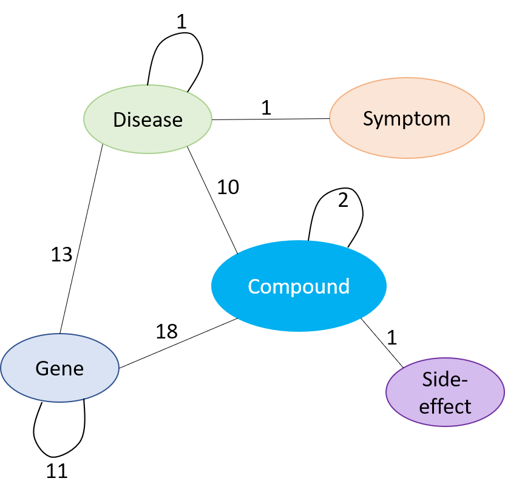

### Summer Intern project @ Novartis
# Slim Drug Repurposing Knowledge Graph
Drug repurposing holds the potential to bring medications with known safety profiles to new patient populations. Knowledge graphs encode structured information of entities and relations, and knowledge graph completion aims to perform link prediction between entities. Therefore, Drug Repurposing Knowledge Graph (DRKG) provides a comprehensive biological knowledge graph to realize drug repurposing. 

Our slim DRKG includes compounds, diseases, genes, side effects and symptoms from three existing databases, which are DrugBank, Hetionet and GNBR. It includes 56,021 entities belonging to 5 entity-types; and 2,307,048 triplets belonging to 57 edge-types. These 57 edge-types show a type of interaction between one of the 8 entity-type pairs (multiple types of interactions are possible between the same entity-pair), as depicted in the figure below. It also includes a bunch of notebooks about how to explore and analysis the DRKG using statistical methodologies or using machine learning methodologies such as knowledge graph embedding.

Format: 

## Statistics of knowledge graph
The type-wise distribution of the entities in DRKG and their original data-source(s) is shown in following table.
entity-type	Drugbank	GNBR	Hetionet	total entities
Compound	9053	3180	1536	9559
Disease	1749	4565	136	4933
Gene	4247	25042	18270	35413
Side Effect	-	-	5701	5701
Symptom	-	-	415	415
total	15049	26492	21866	56021

The following table shows the number of triplets between different entity-type pairs in DRKG and from various data sources.
Entity-type pair	Drugbank	GNBR	Hetionet	Total interactions
(Gene, Gene)	-	62956	474526	537482
(Compound, Gene)	18527	39564	51429	109520
(Disease, Gene)	-	95591	27977	123568
(Compound, Compound)	1332717	-	6486	1339203
(Compound, Disease)	10209	43077	1145	54431
(Disease, Symptom)	-	-	3357	3357
(Disease, Disease)	-	-	543	543
(Compound, Side Effect)	-	-	138944	138944
Total	1361453	241188	704407	2307048

## Dataset and codes
The dataset under the ./data folder contains the following part:
* all the raw data where we extracted triplets from, including drugbank full_database.xml, and hetionet edges
* ./data/embedding, a subfolder including pre-trained embeddings
* triplets.tsv, all triplets we finalized in the form of (h, r, t) triplet
* relation_glossary.tsv, a file containing glossary of the relations in our slim DRKG, and other associated information with sources (if available).

The codes component contains the following part:
* ./drugbank,  a folder containing the codes how we extracted triplets from DrugBank public database
* ./hetionet,  a folder containing the codes how we extracted triplets and uniform the entities in hetionet 
* ./disease_normalize, a folder containing the codes to extract disease-relevant triplets and normalized the disease name into MESH id 
* extract_triplets_gnbr.py, the code to extract GNBR triplets from the other user-friendly dataset
* triplets_clean_up.py, the code the clean-up duplicated triplets across different databases
## Pretrained DRKG embedding
The DRKG embedding is trained using ComplEx model with dimension size of 400, there are four files:
* triple_ComplEx_entity.npy, NumPy binary data, storing the entity embedding
*	triple_ComplEx _relation.npy, NumPy binary data, storing the relation embedding
*	entities.tsv, mapping from entity_name to entity_id.
*	relations.tsv, mapping from relation_name to relation_id
To use the pretrained embedding, one can use np.load to load the entity embeddings and relation embeddings separately:
```
import numpy as np
entity_emb = np.load('./embed/DRKG_TransE_l2_entity.npy')
rel_emb = np.load('./embed/DRKG_TransE_l2_relation.npy')
```
## Tools to analyze DRKG
We analyze DRKG with some deep learning frameworks, including DGL (a framework for graph neural networks) and DGL-KE (a library for computing knowledge graph embeddings). Please follow the instructions below to install the deep learning frameworks in the platform.
### Activate environment in AWS EC2
We train the embedding with AWS EC2 p2.xlarge instance (Deep Learning AMI Ubuntu 16.04 platform), and choose conda-based PyTorch environment. We use PuTTY and WinSCP to get access to the linux instance (AWS EC2 User Guide). Use the following command to activate the environment. Following the user guide (p.20 – p.27) to setup Jupyter server.
```source activate pytorch_latest_p36```
### Install PyTorch
Currently all notebooks use PyTorch as Deep Learning backend. Currently, the dgl-ke_predict command only support torchvision<=0.6.0, so please install PyTorch with the following command. 
```
conda install pytorch torchvision cudatoolkit=10.1 -c pytorch
pip install torch==1.5.0+cu101 torchvision==0.6.0+cu101 -f https://download.pytorch.org/whl/torch_stable.html
```
To install other versions of PyTorch, please go to Install PyTorch.
### Install DGL
Please install DGL (a framework for graph neural networks) with the following command. It installs DGL with CUDA support.
```conda install -c dglteam dgl-cuda10.1     # For CUDA 10.1 Build ```
To install other versions of DGL, please go to Install DGL
### Install DGL-KE
If you want to train the model with notebooks and perform link predict with DGL-KE, you need to install both DGL and DGL-KE package, and follow the command below.
```
git clone https://github.com/awslabs/dgl-ke.git
cd dgl-ke/python
python3 setup.py install
```
## Knowledge graph embedding analysis
We split the edge triplets in training, validation and test sets as follows 90%, 5%, and 5% and train the KGE model as shown in following notebook.

[train_triplets_embedding.ipynb](train_triplets_embedding.ipynb)

## Drug Repurposing Examples Using Pretrained Model
We use dglke_predict command (in DGLKE library) to perform link prediction, which aims to predict the missing h or t for a relation fact triplet (h,r,t). We present a drug repurposing example of using pretrained DRKG model. In the example, we used two of Novartis AG's top 10 drugs based on revenue in 2019, Entresto and Gilenya. For each drug, we predict the missing compound_treat_disease tails; and get the top ranked disease. Link prediction details are shown in the following notebook. 

[Entity Prediction for Drug Re-purpose.ipynb](Entity Prediction for Drug Re-purpose.ipynb)
### Link Prediction Result
For Entresto, Sacubitril is used in combination with Valsartan, serving as a prodrug neprilysin inhibitor to reduce the risk of cardiovascular events in patients with chronic heart failure (NYHA Class II-IV) and reduced ejection fraction. The top ranked diseases that we predicted are listed as: 
- Sacubitril: congenital pain insensitivity, congenital, Hypothermia, Retinal Diseases, Overactive Urinary Bladder, Kidney Diseases, Diabetes Mellitus.
- Valsartan: hypertension, abdominal aortic aneurysm, diabetes mellitus. 

For Gilenya, Fingolimod is a sphingosine 1-phosphate receptor modulator for the treatment of relapsing-remitting multiple sclerosis. It was developed by Novartis and initially approved by the FDA in 2010. The top ranked diseases that we predicted are listed as:

- Fingolimod: Muscular Diseases, Nausea, Van der Woude syndrome, Parkinson Disease, Neoplasms , Optic Nerve Diseases, Metabolic Diseases, Cholestasis
